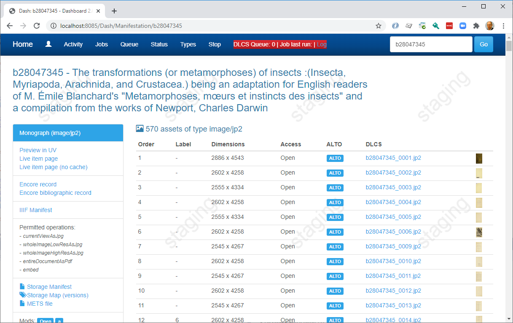
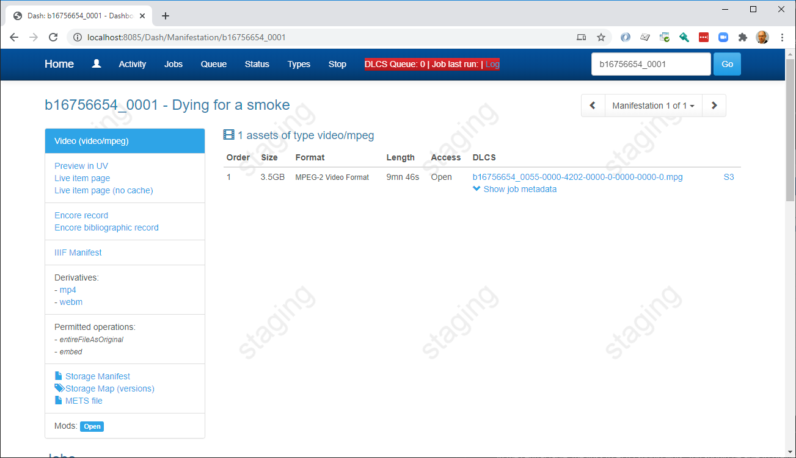
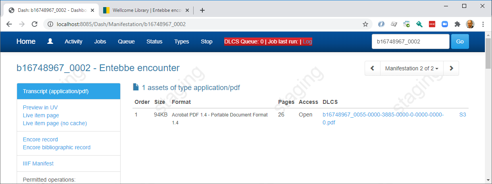
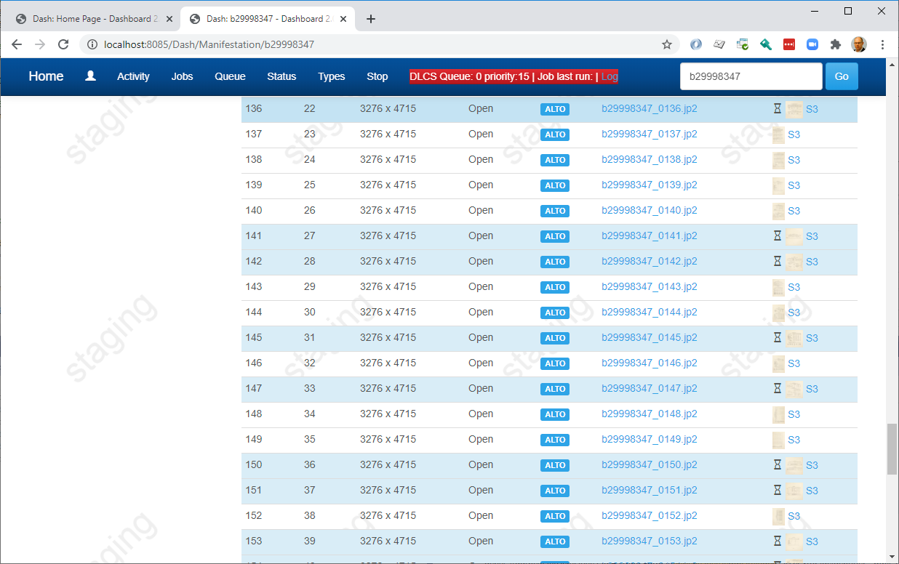
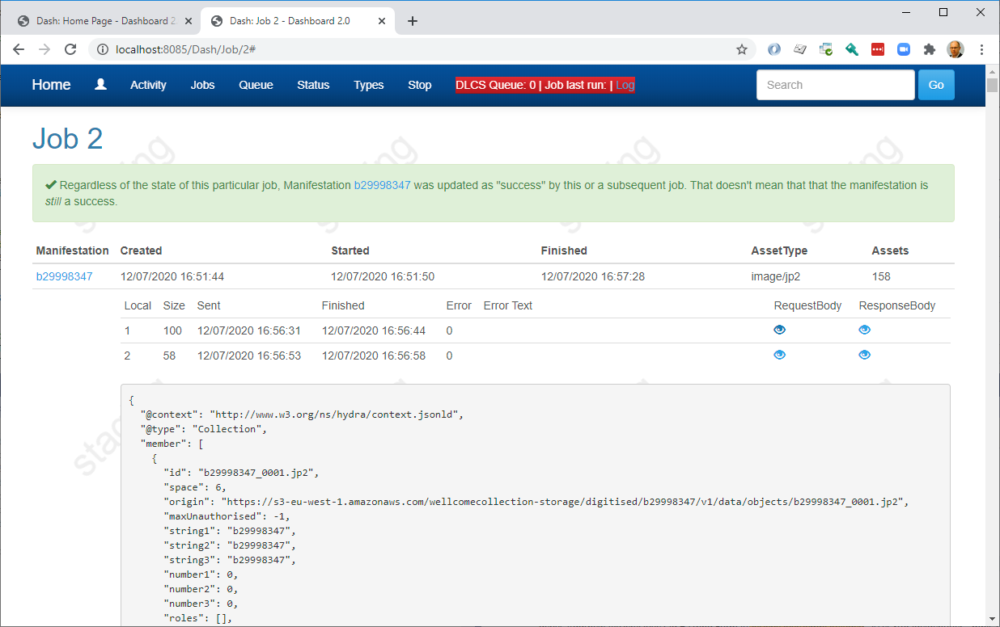

## Notes on dashcontroller PR

There are now two EF migrations, one for DdsInstrumentationContext, and one for DdsContext.

I've moved the location of DdsContext into a new project, that doesn't exist in the old repo. This I hope will make more sense as we migrate DDS functionality across later.

I've also made some changes to the appsettings (my dev version is where we keep our shared secrets).

### Run the project

This should be run against the production storage service.

First, run it with the appSetting in `Dlcs` set to the production space, space 5.

(in appsettings)

```
   ...
    "CustomerDefaultSpace": 5,
   ...
```

I'm using the `aws-azure-login` to acquire roles (for 1 hr) that let the locally running application use both wellcome storage AWS and dlcs-io AWS for the new DDS.

I'm also running against a local PostgreSQL - I haven't yet started running against the live one via SSH. Local PostgreSQL is fine until we need lots of manifestation data though.

The two EF migrations seemed to have created the DBs OK.
The current DBs have some indexes which we'll need to recreate on the new one at some point, although it won't be an issue for a while.

### Then look at a bnumber

[http://localhost:8085/Dash/Manifestation/b28047345](http://localhost:8085/Dash/Manifestation/b28047345)



Down the left hand column, the links to Storage Manifest, Storage Map and METS file should all work.

In the central table, the links to ALTO should work. You should be able to preview the images by clicking on thumbs, and see the object in S3 by clicking on the _Find in S3_ next to the thumbnail (NB this needs a bit of design attention).

Try some other content:

A Video: [http://localhost:8085/Dash/Manifestation/b16756654](http://localhost:8085/Dash/Manifestation/b16756654)



An Image Multiple Manifestation: [http://localhost:8085/Dash/Manifestation/b18031511](http://localhost:8085/Dash/Manifestation/b18031511)

Notice the manifestation navigation on the left, and observe what happens to the URL.


A video with a transcript, as a multiple manifestation: [http://localhost:8085/Dash/Manifestation/b16748967](http://localhost:8085/Dash/Manifestation/b16748967)



## Change the DLCS space

If you change the config to the _staging_ DLCS space:

```
   ...
    "CustomerDefaultSpace": 6,
   ...
```

...then these b numbers appear differently.

We still read the same information from the storage, but now we can see that the DLCS doesn't have a record for the assets:


## A job

_I'm going to switch to a different b number so as not to break the screen shots above._

Pick a different b number. Unfortunately the Search feature in the dashboard won't work yet, that makes API calls to the DDS. But you can use the [thumbs tester](http://tomcrane.github.io/wellcome-today/thumbs.html?manifest=https://wellcomelibrary.org/iiif/b29288885/manifest) to pick random b numbers.

Make sure the new one is image based and not too huge - 100-300 images would be fine, rather than 1000s.

Like the insects book it should be a sea of red.

Press the **Sync** button.

This will create a new job and execute it immediately. As it runs, you can refresh the page and see the status of images changing.



Here the blue lines are in progress. This means the DLCS is processing them (e.g., with Tizer).

You can also see that the DLCS priority queue is at 15 in this screen shot.

After a while, the DLCS has finished and the display settles down:


In the left hand column there will be one or more jobs listed. This shows the record of the sync jobs, including the JSON payloads sent and received:



One of the things we need to do is automate the cleanup of this data - it takes a lot of room in the database and while it is useful for diagnostics occasionally, most of it goes unused.

We could set a flag that determines whether the DDS stores the payload data. Jobs initiated from the dashboard could set it (typically you'd be diagnosing a problem) but jobs run by the jobs processor could omit it.

## Job Running

In this example the dashboard has used the DLCS Job Processor directly (invoking the DLCS' priority queue).

It has synced with the DLCS, but there are various other jobs it hasn't done.

When Goobi calls the DDS to signal that a b number should be processed, it creates a job for the WorkflowProcessor. We don't have that call handling yet, and it will probably be a queue of some sort.

That isn't running (or runnable) just yet.

One of the things the _Workflow_ processor does is prepare the job for the Dlcs Job processor - the same job we just ran directly. Normally, the DlcsJobProcessor running task will pick these up and run them.

The workflow processor _also_ does things with metadata, it builds text maps for search, builds annotations. It currently prepares and caches the _Package_ model that the DDS builds IIIF on top of; in the new version, it will build the IIIF and store it in S3.

All this is still to come.

## Next steps

To get to the current point there has been a fair bit of disruption, mostly with cascading `async` method calls. Some of this has changed quite a lot.

It's also running against a PostgreSQL database rather than SQL Server.

Some of the EntityFramework code has been rewritten.

Some of the more complex raw SQL stuff has been rewritten as EF Linq, this all needs thorough review and testing.

* The massive async overhaul hasn't taken advantage of any potential speed improvements. In fact it's probably slower as a result. It feels a bit slower than it does running at Wellcome.
* This may have introduce subtle bugs, e.g., using `obj as expected` where obj is now `Task<Obj>` and the `as` operator returns null. I have found a few of these.
* There are many skipped over bits, commented out calls that need to be revisited
* While the two biggest calls - go to storage, then go to the DLCS to compare storage with what's in the DLCS - have to be done in order, there are other calls that are currently synchronous that could be run in parallel. Fetching info from jobs db, checking the DLCS queue level, checking the status provider.
* While there are a few concessions to a 2020 ASP.NET Core MVC app, it's not really taking advantage of anything new in ASP.NET MVC. It doesn't _have_ to, but there are plenty of things that will make this code more manageable. The `DashController` is 840 lines long, the Manifestation.cshtml view file is 600 lines, etc - there is a lot of reorganisation and componentisation that will help us maintain this in future. 
* We've lost bundling and minification and may want to renistate them.
* The code to deal with issues (Chemist and Druggist) is not working yet.

That said, there is enough working here to get a good understanding of how the dashboard talks to the DLCS and the storage service.
